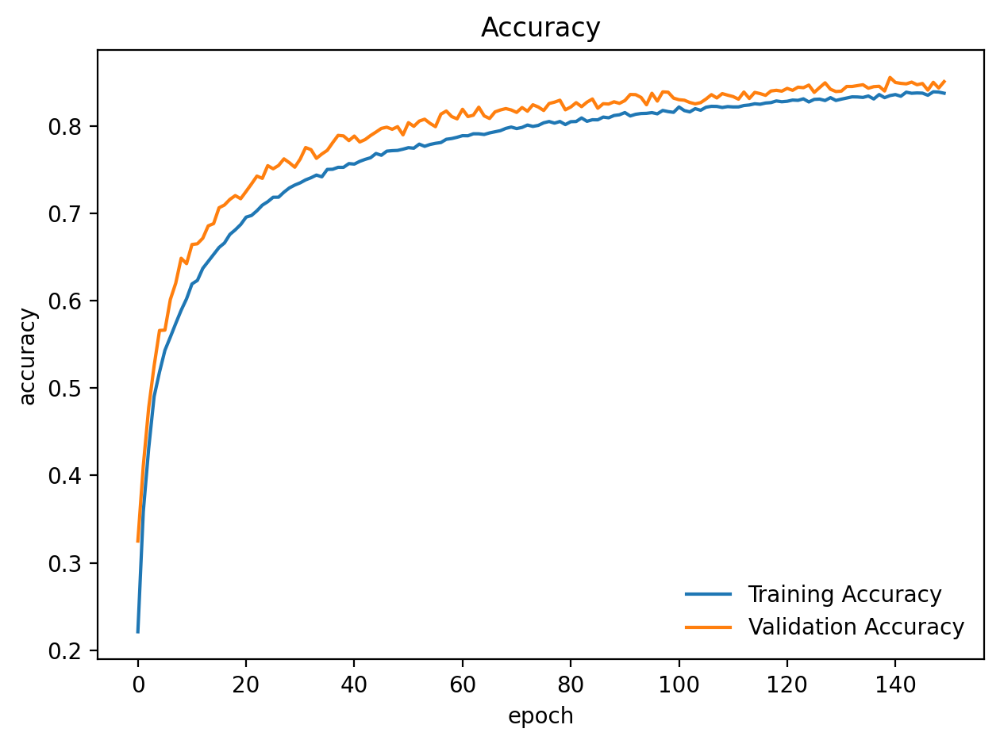
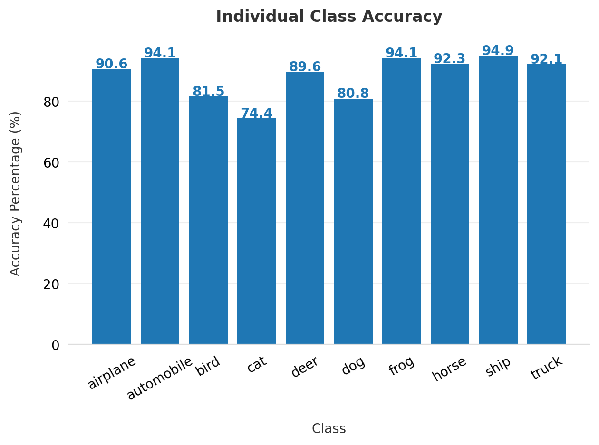

# PyTorch CIFAR-10


A PyTorch implementation for training a medium sized convolutional neural network on CIFAR-10 dataset. CIFAR-10 dataset is a subset of the 80 million tiny image dataset (taken down). Each image in CIFAR-10 dataset has a dimension of 32x32. There are 60000 coloured images in the dataset. 50,000 images for the training data (of which 5,000 is used as a validation set) and the remaining 10,000 images for the test data. The training data is divided into 32 batches. CIFAR-10 has 10 categories. Each category having 6000 images.
## Model Architecture

The model consists of eight Convolutional Layers (with ReLU activation) and each one followed by BatchNormalization to speed up training and ensure stability. 

After each two consecutive Convolutional Layers, Drop out and Max pool filter are applied. Max pool is used to reduce the spatial extent of our network.

Finally, the output features are flattened to pass them through fully connected layers.

Final output is calculated on Log Softmax layer to ensure further stability rather than normal Softmax.
## Steps

1. Creating our transforms for processing dataset's images.
2. Downloading the dataset using ```torchvision.datasets.CIFAR10```
3. Exploring and visualising our training and testing data.
4. Defining our model architecture.
5. Defining our loss function and optimizer.
6. Training the model (P.S. trained using GPU).
7. Including several graphs for loss, accuracy, and accuracy for each class in the dataset.
## Training & Testing

The model was trained in 150 epochs (150 times looping over the entire training set).

It took 1hr 32mins using Google Colab Standard GPUs which are typically NVIDIA T4 Tensor Core.

The model acheived an accuracy of 88.44% on the test set which is good for this medium sized model.
## Requirements

```bash
1. numpy
2. pytorch
3. matplotlib
```
    
## Screenshots




